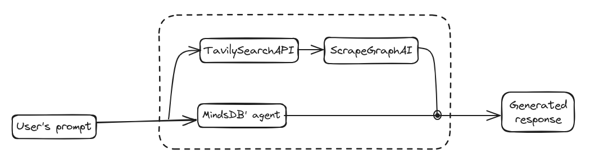
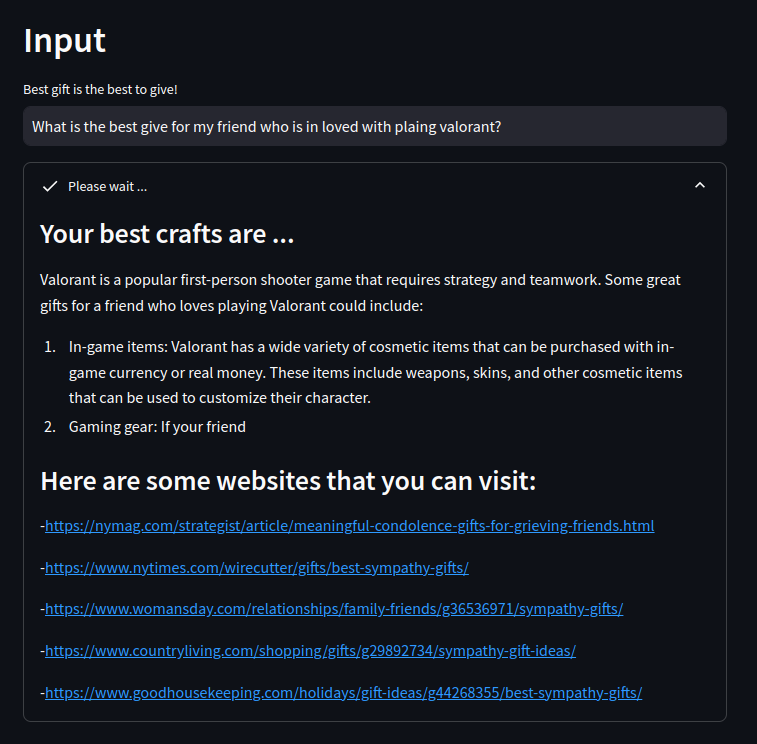

<p align="center">
  
</p>
<h1 align="center">GiftGuru</h1>

<p align="center">
  <em>Makes you gifts have more meanings</em>
</p>

---

<details>
  <summary>Table of Contents</summary>

- [📍 Overview](#-overview)
- [🧩 Features](#-features)
- [🤖Technologies Used](#-technologies-used)
- [🎯 Workflow](#-workflow)
- [🚀 Usage](#-getting-started)
- [👾 Gallery](#-gallery)
- [🧑‍💻 Contact](#-contact)
</details>

## 📍 Overview

GiftGuru is your AI-powered gift-giving companion, here to help you find the perfect present for any occasion. Whether it's Valentine's Day, Christmas, a birthday, or just because, our intelligent system uses cutting-edge AI to suggest thoughtful and personalized gift ideas tailored to your recipient's unique tastes and preferences.

## 🤖 Technologies Used

* **MindsDB:** Our intelligent gift-giving agent is built on MindsDB, a powerful AI engine that enables us to understand complex relationships and generate insightful recommendations.
* **Tavily:** We leverage Tavily's expertise in personalized recommendations to ensure our suggestions are truly relevant and engaging.
* **ScrapeGraphAI:** Our data scraping engine, powered by ScrapeGraphAI, keeps us up-to-date on the latest trends, reviews, and pricing information across a vast range of products and services.


## 🧩 Features

* **Personalized Recommendations:** GiftGuru takes into account your recipient's interests, hobbies, age, relationship to you, and even past gift preferences to suggest truly meaningful and unique gifts.
* **Occasion-Specific Suggestions:**  Need a Valentine's Day gift for your significant other, a birthday present for your best friend, or a thoughtful stocking stuffer for your niece? GiftGuru has you covered with tailored suggestions for every occasion.
* **Creative & Unique Ideas:**  Go beyond the ordinary with our AI-powered suggestions. We uncover hidden gems and unique gifts you might not find anywhere else.
* **Easy-to-Use Interface:**  Finding the perfect gift has never been easier. Our intuitive interface makes navigating through suggestions and exploring options a breeze.


## 🎯 Workflow
GiftGuru employs a multi-faceted approach to guide users towards thoughtful and meaningful
gifts. Our methodology leverages a combination of cutting-edge technologies and human-centric
insights, ensuring a personalized and enriching gift-giving experience.



The process is as follows:

1. **Understanding Your Needs**: GiftGuru starts by capturing the essence of your gift-giving
intention. Through a simple, user-friendly interface, you'll provide details about the
recipient, their interests, and the occasion.

2. **The Knowledge Graph**: This is where our "brain" comes into play. GiftGuru utilizes a
sophisticated knowledge graph, built from vast amounts of curated data about products,
people, and relationships. This graph allows us to understand the intricate connections
between different gift ideas and recipient preferences.

3. The Search and Selection Process:

  + *TavilySearchAPI*: We leverage a powerful search engine API to uncover relevant
product information from a vast online marketplace. This ensures a
comprehensive range of gift options.
  + *ScrapeGraphAI*: To enhance the accuracy and relevance of our suggestions, we
employ a specialized AI that analyzes product reviews, popularity trends, and user
feedback. This helps identify truly meaningful gifts that align with the recipient's
preferences.

4. **Personalized Recommendations**: Drawing upon the knowledge graph, search results, and
AI-powered analysis, GiftGuru generates a personalized recommendation and several
websites that user’s can refer to to improve their choices of gifts

## 🚀 Usage

1. Setup environments 

Firstly, we run the following command line to install `MindsDB`: 

```
docker run --name mindsdb_container -p 47334:47334 -p 47335:47335 mindsdb/mindsdb
```
After that, we download the github repo and install necesaary libraries: 

```
git clone https://github.com/MinLee0210/GiftGuru.git
cd GiftGuru
pip install -r requiremnets.txt

```

Create a `.env` file to store environment varibles. I'll leave an example in the `.env.example` file. Remember that this project also use Ollama while using the `ScrapeGraphAI`, therefore, you also need to install `Ollama`. 

2. Running the project

The project is implemented in a way that you can easily read the code and easily adjust based on their needs. To run the project, follow this command line

```
streamlit run app.py
```

*Note*: I left several examples of calling API in the `./test`. In addition, I highly recommend you to view the `http://localhost:47334`, which is the default port of `MindsDB`, to view the GUI, also, catch up with the process. 


## 👾 Gallery

+ **Result:**




## 🧑‍💻 Contact

+ **Gmail**: minh.leduc.0210@gmail.com
+ **LinkedIn**: https://www.linkedin.com/in/minh-le-duc-a62863172/
+ **Medium**: https://medium.com/@octoopt_8888
